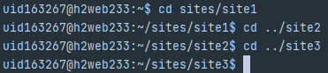
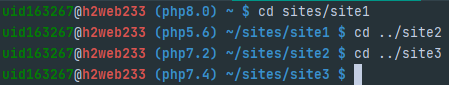

# Infomaniak webhosting bashrc

Infomaniak webhosting offers SSH access to your account.

This ``.bashrc`` switches the **PHP cli version** as configured in your ``.php-version``.

## How to use it

1/ To install this ``.bashrc``, open an SSH connexion to your webhosting account.

2/ Then get the latest version from github and profit :

```shell
wget https://raw.githubusercontent.com/mathieu-coingt/infomaniak-ssh-php-version/main/.bashrc -O $HOME/.bashrc
```
```shell
source $HOME/.bashrc
```

3/ Finally, you have to create a ``.php-version`` file in your folders where you want to change you PHP cli version : [see exemple in this repository](.php-version).

Just write in this file the PHP version you want to use. Possible values are the one you can choose in your Infomaniak manager :
* 8.0
* 7.4
* 7.3
* 7.2
* 5.6

## Enhanced the prompt

Also, you can use the ``.bash_profile`` file given here, wich will show you in the prompt the PHP cli version used, and also gave you some colors ;-)

```shell
wget https://raw.githubusercontent.com/mathieu-coingt/infomaniak-ssh-php-version/main/.bash_profile -O $HOME/.bash_profile
```

## How to test it
You may have to close your SSH connection and connect again.
You can check the changes by navigating in your folder where you have write ``.php-version`` file : your prompt has to indicate you the PHP cli version used, and you can verify it by tiping ``php -v``

## Result expected

### Before


### After

